# By Freelancer Febriano for Demo task.pdf 
# Đurđevac map

## See it Live

Click here [https://durdevacmap.spiritbro.now.sh/](https://durdevacmap.spiritbro.now.sh/)

## Task 1

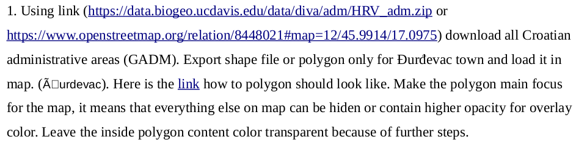

## Task 1 Result

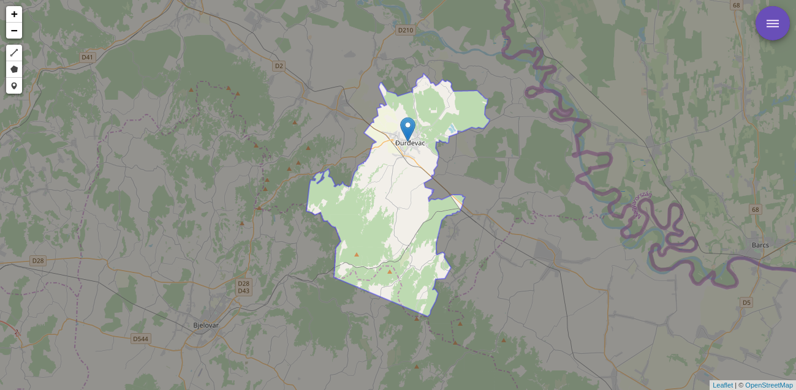

## Task 2

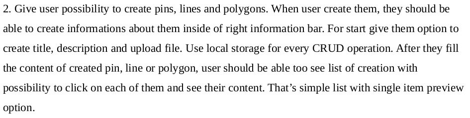

## Task 2 Result

### How to create pin

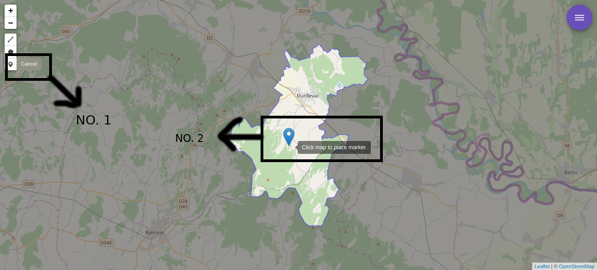

First of all click the pin icon on the top left side of your screen, in the image above you see text "no. 1", and then after that you can see your pointer change into a pin just like you see on the image in the middle with the text "no. 2"

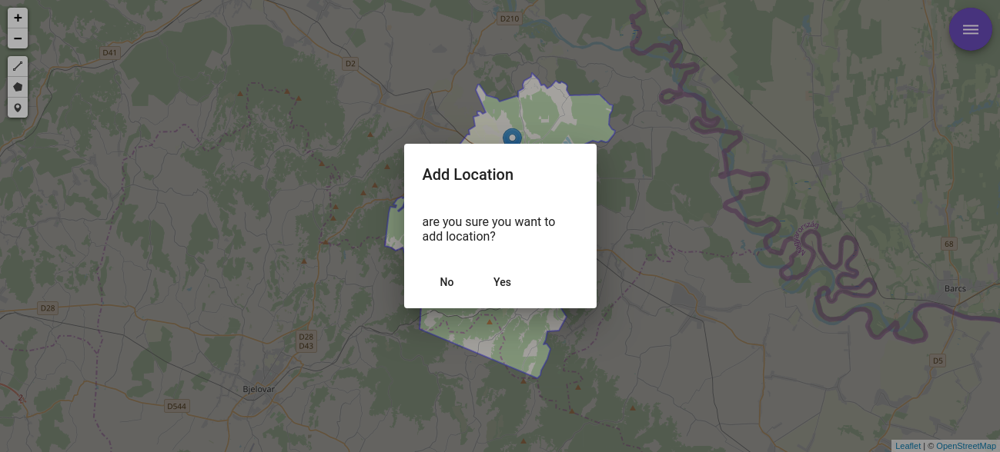

after you click a location on the map, you will be asked if you want to add the location or not, if you click "yes" the location will be added, if you click "no" the location will be removed, for now lets click "yes"

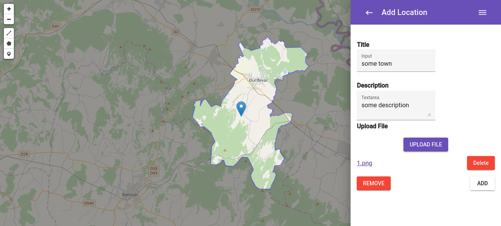

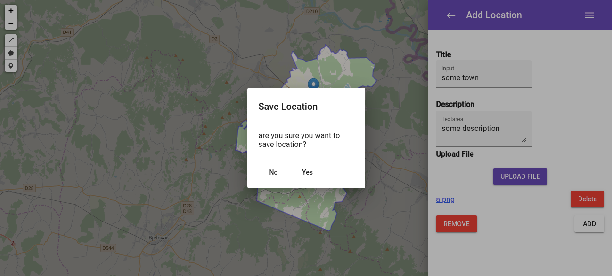

there will be a sidebar on the right side of your screen and you can add some information on it, to finish, click "add" button on the bottom right side of your screen, and click "yes"

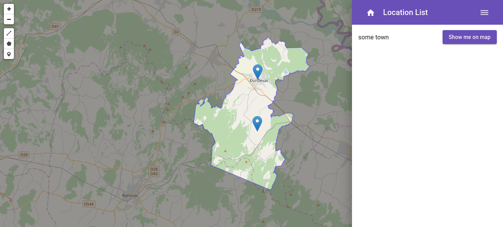

and then you will see your location added, on the right side click "show me on map"

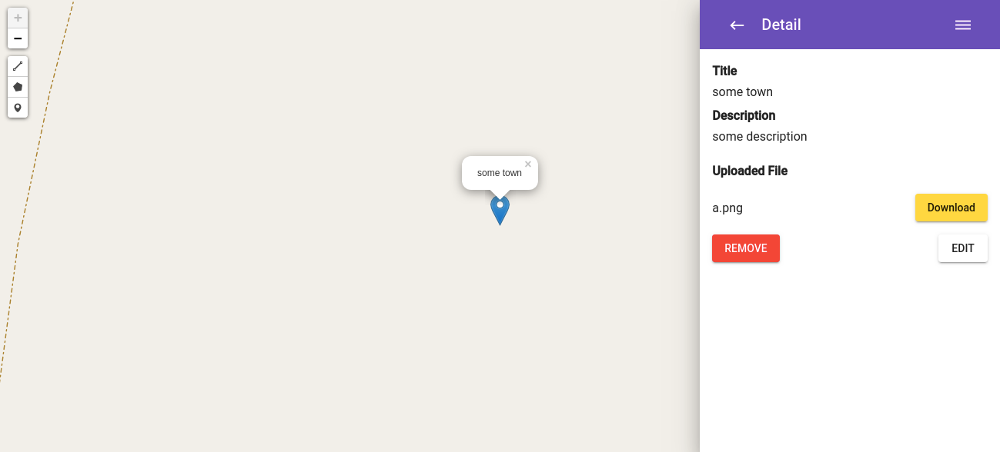

when you click "show me on map" you will see your pin also the detail on the right side, you can also download your file, and edit the description, right now lets edit the description by clicking "edit"

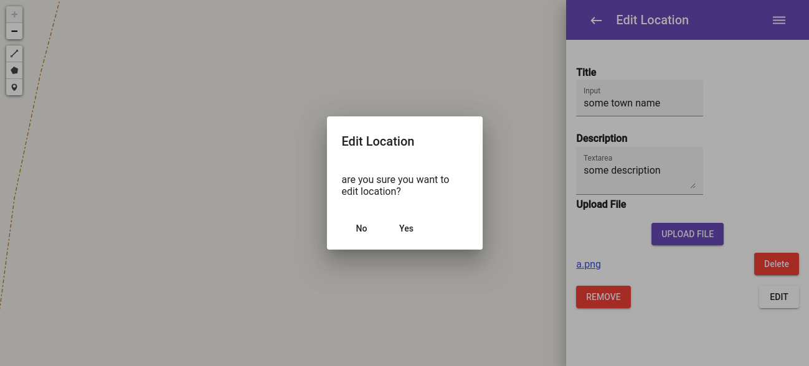

here i change the name to "some town name", and then click edit after you finish and click "yes"

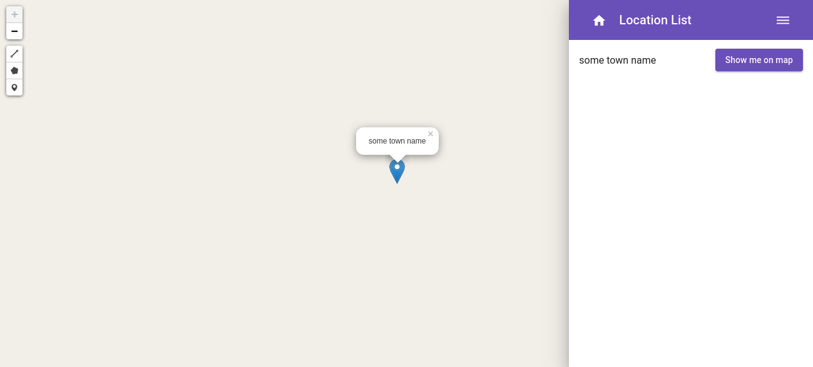

after that you will see your detail name change on screen, for creating polygon and line the step is the same as the above

## Task 3

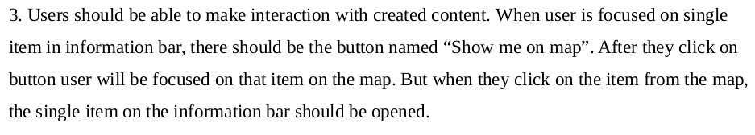

## Task 3 Result

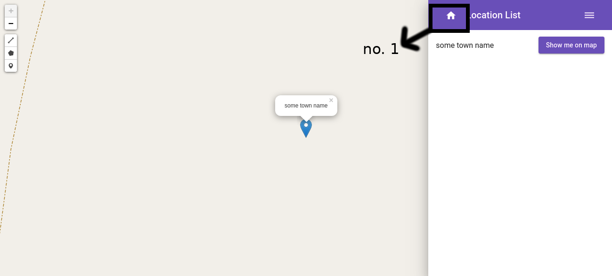

first of all click on the home button as seen on the screen on the image you can see the black box with caption "no. 1" in it click that button to see the full durdevac map again

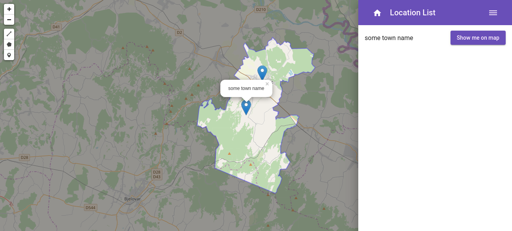

now click on "show me on map" or one of the pin you will be focused on the pin and the detail will be shown on the right side of the screen

This project was generated with [Angular CLI](https://github.com/angular/angular-cli) version 9.1.0.

## Development server

Run `ng serve` for a dev server. Navigate to `http://localhost:4200/`. The app will automatically reload if you change any of the source files.

## Code scaffolding

Run `ng generate component component-name` to generate a new component. You can also use `ng generate directive|pipe|service|class|guard|interface|enum|module`.

## Build

Run `ng build` to build the project. The build artifacts will be stored in the `dist/` directory. Use the `--prod` flag for a production build.

## Running unit tests

Run `ng test` to execute the unit tests via [Karma](https://karma-runner.github.io).

## Running end-to-end tests

Run `ng e2e` to execute the end-to-end tests via [Protractor](http://www.protractortest.org/).

## Further help

To get more help on the Angular CLI use `ng help` or go check out the [Angular CLI README](https://github.com/angular/angular-cli/blob/master/README.md).

